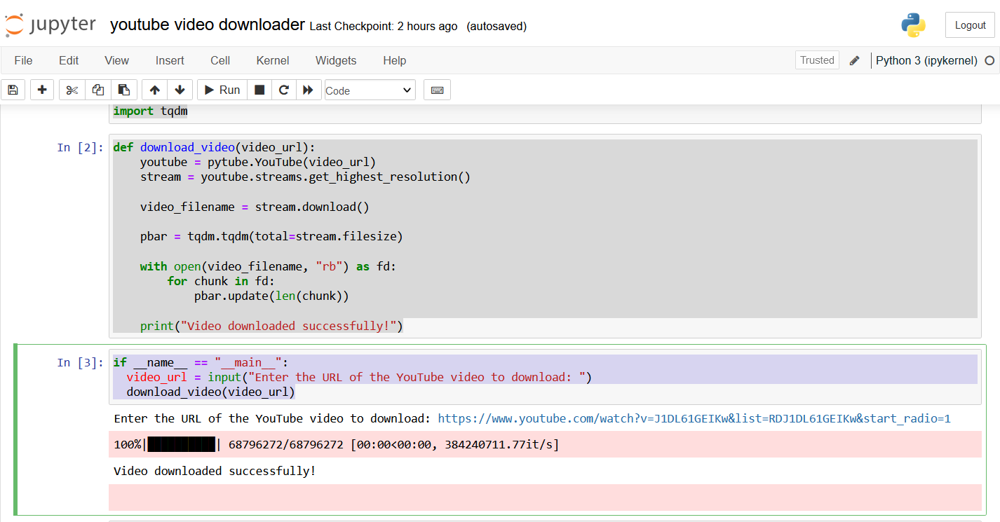

# YouTube Video Downloader with Progress Bar

This Python script allows you to download YouTube videos with the highest resolution available and displays a progress bar to track the download progress. It uses the Pytube library for YouTube video downloading and the tqdm library for the progress bar.

## Prerequisites

Before using this script, you need to have the following installed on your system:

- Python (3.6 or higher)
- [Pytube](https://github.com/nficano/pytube): You can install it using `pip install pytube`
- [tqdm](https://github.com/tqdm/tqdm): You can install it using `pip install tqdm`

## Usage

1. Clone this repository or download the script.

2. Open a terminal or command prompt.

3. Navigate to the directory where the script is located.

4. Run the script using the following command:

python download_video.py

5. The script will prompt you to enter the URL of the YouTube video you want to download.

6. It will then download the video with the highest resolution available and display a progress bar to track the download progress.

7. After the download is complete, you will see a "Video downloaded successfully!" message.

## Example

Here's an example of how to use the script:

$ python download_video.py
Enter the URL of the YouTube video to download: https://www.youtube.com/watch?v=your_video_id

## License

This project is licensed under the MIT License. See the [LICENSE](LICENSE) file for details.

## Acknowledgments

- Pytube: https://github.com/nficano/pytube
- tqdm: https://github.com/tqdm/tqdm
